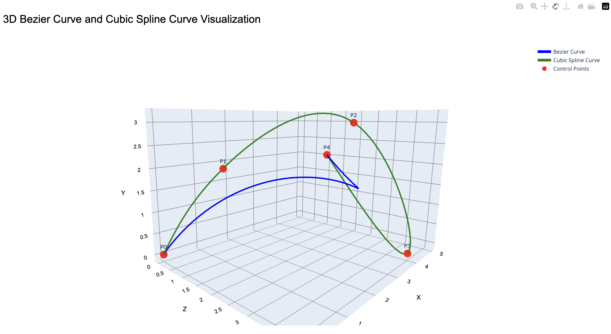
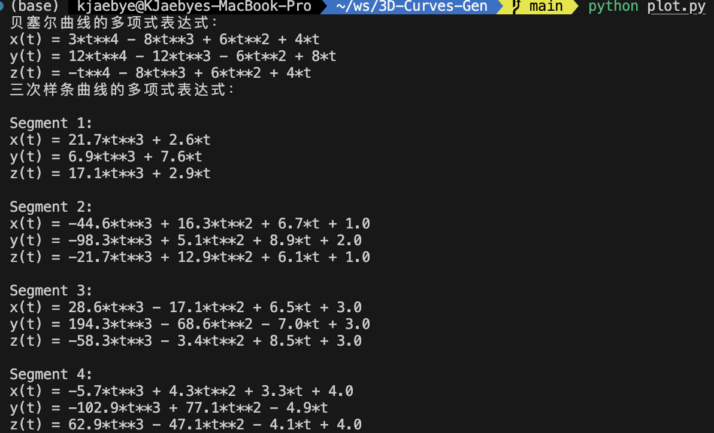

# 3D-Curves-Gen
This repo is for generating 3D curves by bezier and cubic spline.

## Dependence
It dependes on `numpy`, `plotly`, `scipy`, `sympy`. Simply install by pip.

## Usage
You can indicate a list of control points like in `plot.py`:
```python
control_points = [(0, 0, 0), (1, 2, 1), (3, 3, 3), (4, 0, 4), (5, 2, 1)]
```
then run `plot.py` and get the result on browser. The result looks like this:

